# Hostel-Hub
## Description
The HostelHub project aims to revolutionize hostel management within educational institutions by introducing an innovative digital application. Traditional manual processes for tasks such as room allocation, complaint submission, and maintenance requests are replaced with automated systems, streamlining administrative tasks and improving efficiency. The project's primary goals include developing an intuitive and user-friendly platform tailored to meet the specific needs of hostel residents and administrators, enhancing the overall resident experience, and promoting sustainability by reducing paper usage. By leveraging modern technologies and agile development methodologies, HostelHub seeks to address student dissatisfaction with conventional hostel administration methods while fostering a more eco-friendly and supportive living environment.

## Features
- User authentication: Secure login and registration system for administrators and residents.

- Complaints and feedback: Easy submission and tracking of complaints and feedback by residents.

- Room Cleaning Request: Submit requests for room cleaning.

- Workforce Distribution: Analyze and optimize the distribution of staff resources.

- Admin dashboard: Comprehensive dashboard for administrators to monitor and manage hostel operations.

## DATA FLOW DIAGRAM
 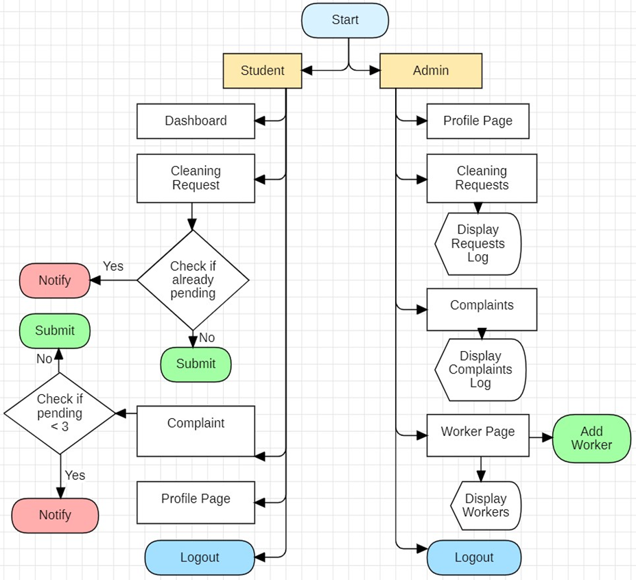
Data Flow Diagram

## USE CASE DIAGRAM
 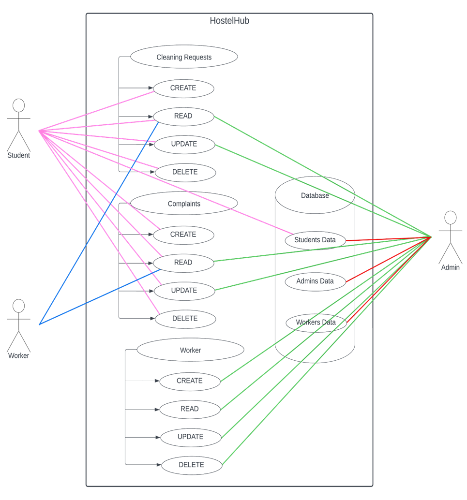
USE CASE DIAGRAM

## SEQUENCE DIAGRAM
 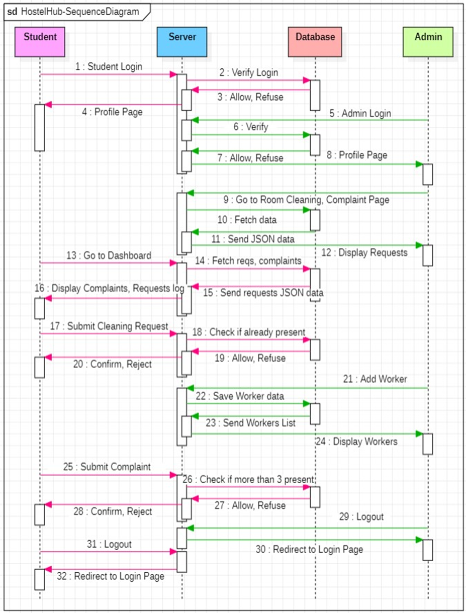
SEQUENCE DIAGRAM

## Installation
1. Clone the repository: `git clone https://github.com/your-username/hostel-hub.git`
2. Navigate to the project directory: `cd hostel-hub/client`
3. Install the dependencies: `npm install`
4. Navigate to the project directory: `cd hostel-hub/server`
5. Install the dependencies: `npm install`
7. Configure the environment variables: Create a `.env` file and set the required variables.
8. Start the application: `npm start`

## Technologies Used
- Node.js
- React.js
- MongoDB
- HTML/CSS
- JavaScript

## MODULE DESCRIPTION

- Module 1: Student Interface
Dashboard: 
•	Displaying relevant information such as cleaning requests and
complaints (READ).
Cleaning Requests:
•	CREATE: Students can submit requests for room cleaning.
•	UPDATE: Students can modify or update their cleaning requests.
•	DELETE: Students can cancel or delete their cleaning requests.
Complaints:
•	CREATE: Students can lodge complaints regarding hostel facilities or services.
•	UPDATE: Students can edit or update their complaints.
•	DELETE: Students can remove or cancel their complaints.
Profile:
•	READ: Students can view their account details.

- Module 2: Admin Panel
Dashboard: 
•	Providing an overview of workers, cleaning requests and complaints.
Worker section:
•	CREATE, READ, UPDATE, DELETE: Admin can manage workers by creating, reading, updating, and deleting them.
Cleaning Requests:
•	READ: Admins can view details of cleaning requests.
•	UPDATE: Admins can update the status or details of cleaning requests.
Complaints:
•	READ: Admins can access complaints and their details.
•	DELETE: Admins can remove or resolve complaints.
•	Profile:
•	READ: Students can view their account details.

- Module 3: User Authentication and Authorization
REST APIs:
•	Routes: Define routes for handling CRUD operations for cleaning requests, complaints, and other functionalities.
•	Speech Recognition & Voice Control commands:
•	Integration of Web Speech API: Implement speech recognition for input and voice commands for controlling certain features, enhancing accessibility and user experience.
Database:
•	Schema models: Define schemas for cleaning requests, complaints, users, etc., to structure and organize data effectively.
•	MongoDB

- Module 4: Dependencies (major):
•	React: Frontend library for building user interfaces.
•	Axios: Promise-based HTTP client for making HTTP requests from the frontend.
•	Redux: State management library for managing application state efficiently.
•	Material-ui/icons: Icons library for incorporating visual elements into the user interface.
•	Express: Web application framework for building APIs and backend services.
•	Mongoose: MongoDB object modeling tool designed to work in an asynchronous environment, and Node.js, used for interacting with MongoDB database.
•	Twilio: It serves as a customizable communication platform enabling users to initiate and receive phone calls, exchange text messages, and execute various communication tasks via its suite of web service APIs.

## OUTCOME

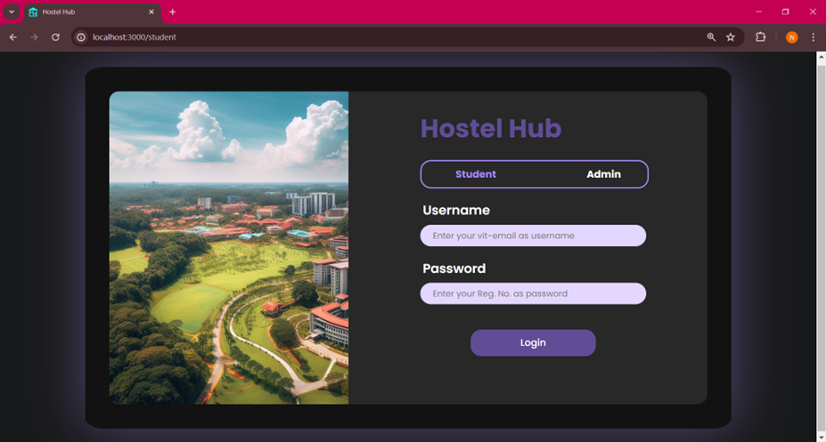
Signin Page

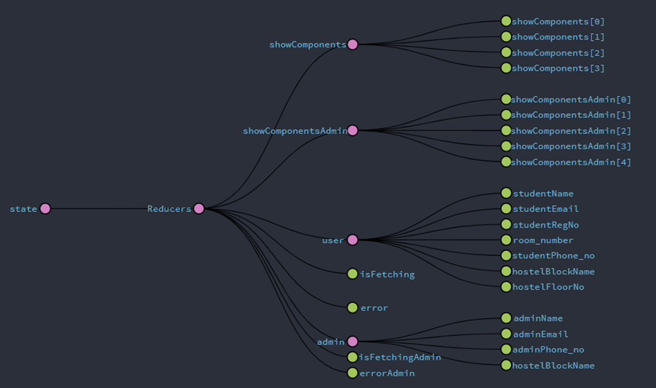
State Management using React-Redux

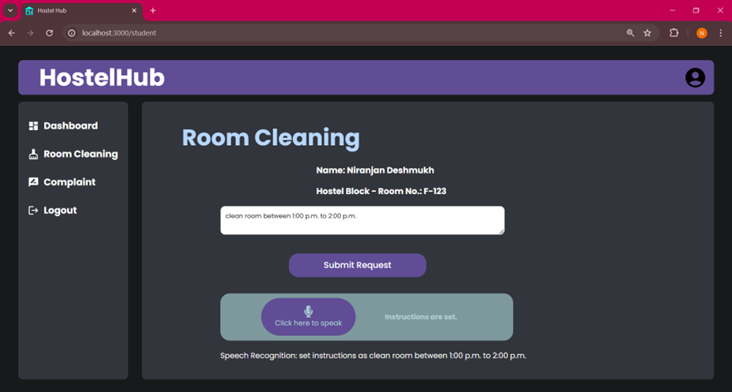
Room Cleaning Page

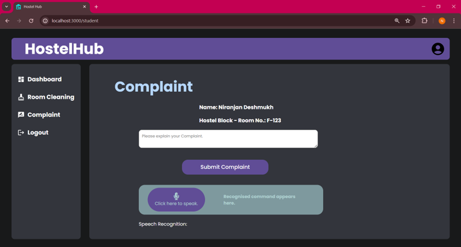
Complaint Page

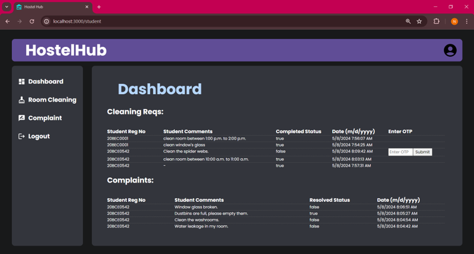
Student Dashboard Page

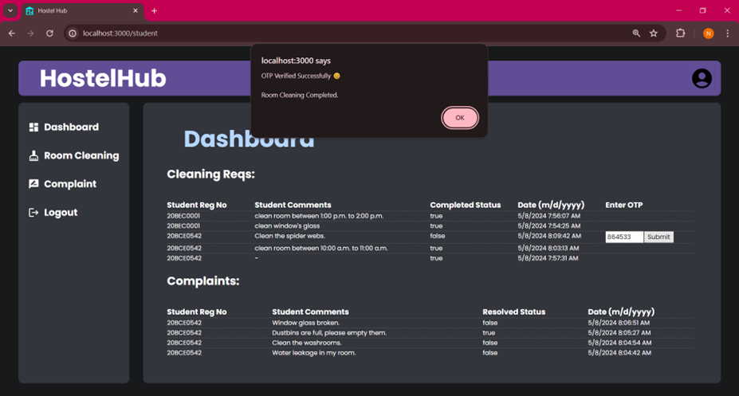
OTP Verification

Admin - Workers’ Page

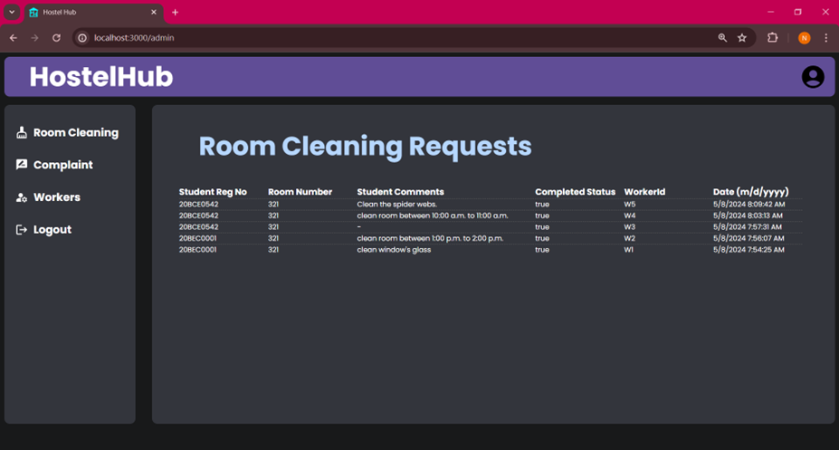
Admin Room Cleaning Display Page

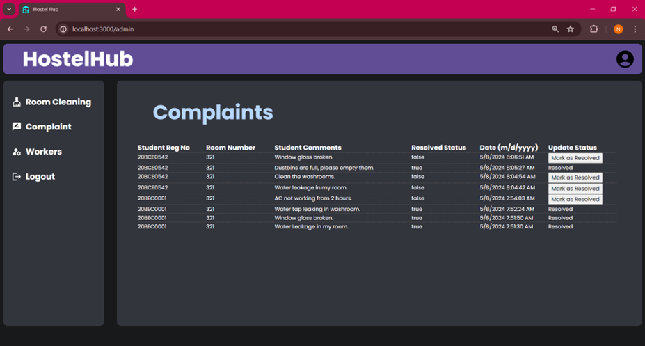
Admin - Complaints Display Page

## Contributing
Contributions are welcome! If you would like to contribute to Hostel-Hub, please follow these steps:
1. Fork the repository.
2. Create a new branch for your feature or bug fix.
3. Make the necessary changes and commit them.
4. Push your changes to your forked repository.
5. Submit a pull request to the main repository.

## License
This project is licensed under the MIT License. See the [LICENSE](LICENSE) file for more details.

## Contact
For any inquiries or support, please email us at hostelhub@example.com.